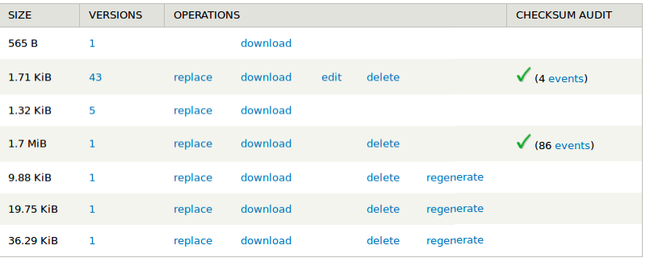
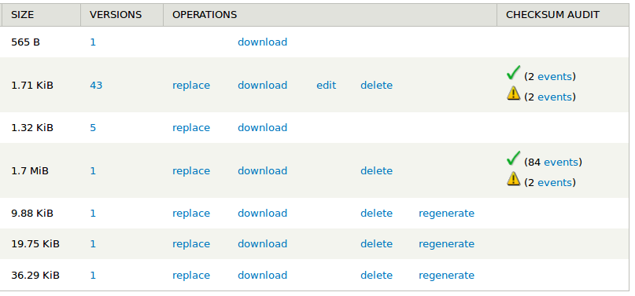

# Islandora Checksum Audit

Utility module that displays an overview of the checksum validation events from an Islandora object's Audit datastream. These events are generated by [Islandora Checksum Checker](https://github.com/islandora/islandora_checksum_checker).

## Requirements

* [Islandora Checksum Checker](https://github.com/islandora/islandora_checksum_checker)

## Configuration and usage

This module does not have any configuration options. When it is enabled, an extra column will appear at the end of the datastream list at an objects Manage > Datastreams tab containing a count of the valid checksum validation events in the object's Audit datastream:

If any invalid (failed) events exist, they will also be indicated in this column:

Clicking on the 'events' link will provide a list of all checksum validation events.

## Maintainer

* [Mark Jordan](https://github.com/mjordan)

## Development and feedback

Bug reports, use cases and suggestions are welcome. If you want to open a pull request, please open an issue first.

## License

[GPLv3](http://www.gnu.org/licenses/gpl-3.0.txt)
